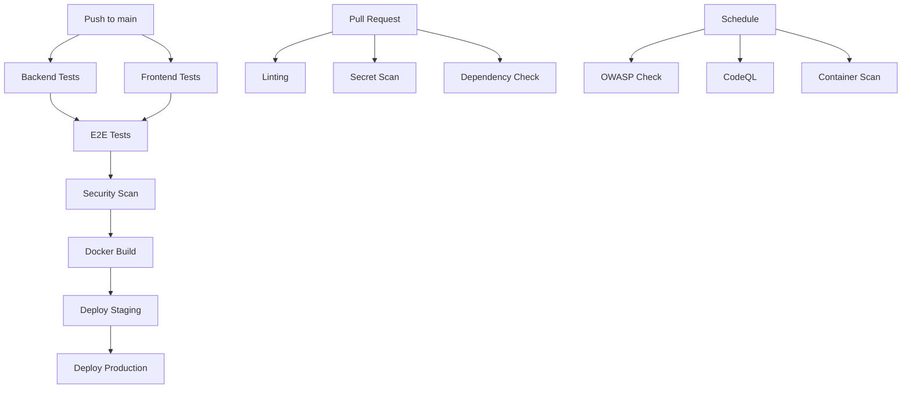

# GitHub Actions CI/CD Workflows

This directory contains the CI/CD pipeline configurations for the Pfinni Dashboard project.

## Workflows Overview

### 1. CI/CD Pipeline (`ci-cd.yml`)
**Trigger**: Push to main/develop, Pull requests to main

Main workflow that handles:
- Backend testing with SurrealDB
- Frontend testing and linting
- E2E testing with Playwright
- Security scanning with Trivy and Bandit
- Docker image building and pushing
- Deployment to staging/production

### 2. Pull Request Checks (`pr-checks.yml`)
**Trigger**: Pull request events

Automated checks for PRs:
- Python linting (Black, Flake8, isort, MyPy)
- Frontend linting (ESLint, Prettier)
- Secret scanning with Gitleaks
- Dependency security checks
- Bundle size analysis
- Automated PR comments with results

### 3. Security Scan (`security-scan.yml`)
**Trigger**: Weekly schedule (Monday 2 AM UTC), Manual

Comprehensive security scanning:
- OWASP Dependency Check
- CodeQL analysis for Python and JavaScript
- Container vulnerability scanning
- Python security audit (Bandit, Safety, Semgrep)
- npm security audit
- HIPAA compliance checks

### 4. Deploy (`deploy.yml`)
**Trigger**: Manual workflow dispatch

Controlled deployment workflow:
- Environment selection (staging/production)
- Version selection
- Database migrations
- Blue-green deployment
- Smoke tests
- Automatic rollback on failure

### 5. Release (`release.yml`)
**Trigger**: Git tags (v*)

Release automation:
- GitHub release creation with changelog
- Docker image tagging and publishing
- Deployment artifact creation
- Documentation updates
- Optional production deployment

## Required Secrets

Configure these secrets in your GitHub repository:

### Authentication & Security
- `CLERK_SECRET_KEY_TEST` - Clerk secret key for testing
- `CLERK_PUBLISHABLE_KEY_TEST` - Clerk publishable key for testing
- `CLERK_SECRET_KEY` - Production Clerk secret key
- `CLERK_PUBLISHABLE_KEY` - Production Clerk publishable key

### External Services
- `LOGFIRE_TOKEN_TEST` - Logfire token for testing
- `LOGFIRE_TOKEN` - Production Logfire token
- `RESEND_API_KEY` - Email service API key

### Docker Registry
- `DOCKER_USERNAME` - Docker Hub username
- `DOCKER_PASSWORD` - Docker Hub password

### Database
- `SURREALDB_URL` - Production database URL
- `SURREALDB_USERNAME` - Production database username
- `SURREALDB_PASSWORD` - Production database password
- `SURREALDB_DATABASE` - Production database name
- `SURREALDB_NAMESPACE` - Production namespace

### Deployment
- `PRODUCTION_API_URL` - Production API URL
- `VERCEL_TOKEN` - Vercel deployment token (if using Vercel)
- `VERCEL_ORG_ID` - Vercel organization ID
- `VERCEL_PROJECT_ID` - Vercel project ID

## Environment Configuration

### Testing Environment
The CI pipeline automatically creates a `.env.test` file with test configurations. This includes:
- Test database connections
- Mock authentication keys
- Disabled rate limiting for tests

### Staging Environment
Uses the same configuration as production but with:
- Separate database
- Lower resource allocation
- More verbose logging

### Production Environment
Full production configuration with:
- Production database
- Full security measures
- Rate limiting enabled
- Minimal logging

## Workflow Dependencies



## Best Practices

1. **Branch Protection**: Enable branch protection rules for main branch
2. **Required Checks**: Make CI tests required for PR merges
3. **Secret Rotation**: Regularly rotate secrets and tokens
4. **Review Deployments**: Use environment protection rules for production
5. **Monitor Costs**: GitHub Actions usage can add up with frequent runs

## Local Testing

To test workflows locally, use [act](https://github.com/nektos/act):

```bash
# Install act
brew install act

# Run a specific workflow
act -W .github/workflows/ci-cd.yml

# Run with secrets
act -W .github/workflows/ci-cd.yml --secret-file .secrets
```

## Troubleshooting

### Common Issues

1. **SurrealDB Connection Failures**
   - Ensure the service container is healthy
   - Check connection string format
   - Verify credentials

2. **Docker Build Failures**
   - Check build args are provided
   - Ensure base images are accessible
   - Review multi-stage build syntax

3. **Test Failures**
   - Check for hardcoded values
   - Ensure test database is isolated
   - Review async test handling

4. **Deployment Failures**
   - Verify all secrets are set
   - Check deployment scripts have execute permissions
   - Review health check endpoints

## Monitoring

- **GitHub Actions Tab**: Monitor workflow runs
- **Deployment Environments**: Track deployment history
- **Security Tab**: Review security alerts
- **Insights > Actions**: View usage metrics

## Future Improvements

1. Add performance testing workflow
2. Implement canary deployments
3. Add database backup before migrations
4. Integrate with external monitoring
5. Add cost optimization for Docker builds